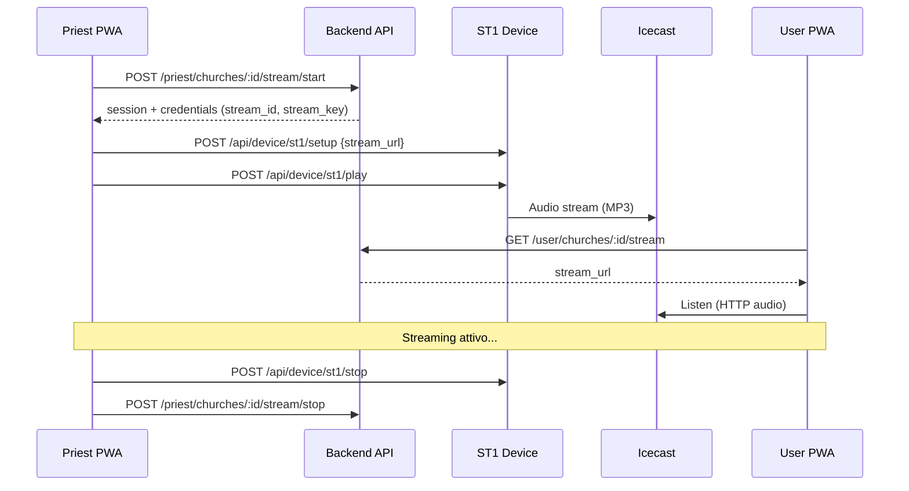

# Verbum Digital Web Radio

Sistema di streaming audio per chiese. Un sacerdote avvia la trasmissione in diretta tramite un dispositivo ST1, e i fedeli ascoltano da un'app mobile.

## Architettura

```
┌─────────────┐     ┌─────────────┐     ┌──────────────┐
│  Admin PWA  │     │ Priest PWA  │     │  User PWA    │
│  :3000      │     │  :3001      │     │  :3002       │
└──────┬──────┘     └──────┬──────┘     └──────┬───────┘
       │                   │                   │
       │         ┌─────────┴─────────┐         │
       └─────────┤  Backend Go API   ├─────────┘
                 │  :8081            │
                 └─────────┬─────────┘
                           │
          ┌────────────────┼────────────────┐
          │                │                │
    ┌─────┴─────┐   ┌─────┴─────┐   ┌─────┴──────┐
    │   MySQL    │   │  Icecast  │   │  ST1 Device│
    │ :3306      │   │  :8000    │   │  :8080     │
    └───────────┘   └───────────┘   └────────────┘
```

## Quick Start (sviluppo locale)

### Prerequisiti

- [Go 1.23+](https://go.dev/dl/)
- [Node.js 22+](https://nodejs.org/)
- [Docker Desktop](https://www.docker.com/products/docker-desktop/)

### 1. Clona e configura

```bash
git clone <repo-url>
cd verbumdigital-web-radio

# Crea il file .env dalla copia di esempio
cp .env.example .env
# Modifica .env con le tue credenziali
```

### 2. Avvia il database

```bash
docker compose up -d
```

Questo avvia MySQL ed esegue automaticamente la migrazione (`001_initial_schema.sql`).

### 3. Crea il primo admin

```bash
# Genera hash bcrypt (dalla cartella backend)
cd backend
go run ../tools/gen-hash.go <password>

# Inserisci l'admin nel database
docker exec -i vd-mysql mysql -ust1stream -p"your_password" st1stream < ../tools/seed-admin.sql
```

Oppure modifica `tools/seed-admin.sql` con il tuo hash e le tue credenziali prima di eseguirlo.

### 4. Avvia il backend

```bash
cd backend
cp ../.env .env    # oppure crea un .env specifico per il backend
go run ./cmd/server
# → Server starting on :8081
```

### 5. Avvia il Mock ST1 (simulazione dispositivo)

```bash
node tools/mock-st1.js
# → Mock ST1 (smixRest) running on http://localhost:8085
```

### 6. Avvia le PWA

```bash
# Terminale 1 — Admin
cd frontend/admin && npm install && npm run dev

# Terminale 2 — Priest
cd frontend/priest && npm install && npm run dev

# Terminale 3 — User
cd frontend/user && npm install && npm run dev
```

> **Nota**: Se il Mock ST1 è su una porta diversa da 8080, creare un file `.env` nella PWA Priest con `VITE_ST1_BASE_URL=http://localhost:8085`.

## Stack Tecnologico

| Layer     | Tecnologia                | Note                                                           |
| :-------- | :------------------------ | :------------------------------------------------------------- |
| Backend   | Go 1.23 + Gin + GORM      | REST API con JWT, Hostato su Hetzner (`verbumdigital.service`) |
| Database  | MySQL 8.0                 | 10 tabelle (`int32` PKs), Hostato su Hetzner                   |
| Frontend  | React + Vite + TypeScript | 3 PWA su Vercel (`app`, `admin`, `priest` `.verbumdigital.it`) |
| Streaming | Icecast                   | Server remoto su `vdserv.com:8000`                             |
| Hardware  | ST1 (smixRest)            | Dispositivo audio → Icecast                                    |

## Struttura del Progetto

```
verbumdigital-web-radio/
├── backend/
│   ├── cmd/server/main.go          # Entry point + routing + CORS
│   ├── internal/
│   │   ├── config/                 # Env vars → config struct
│   │   ├── handlers/               # HTTP handlers (admin, priest, user, device, auth)
│   │   ├── middleware/             # JWT auth, role-based access, device auth
│   │   ├── models/                 # GORM models
│   │   └── services/              # Business logic
│   ├── migrations/                 # SQL migrations
│   └── .env                        # Credenziali locali (non committare)
│
├── frontend/
│   ├── shared/                     # Codice condiviso
│   │   ├── api/client.ts           # API client (backend + ST1)
│   │   └── api/types.ts            # TypeScript types
│   ├── admin/                      # PWA Admin (:3000)
│   ├── priest/                     # PWA Priest (:3001)
│   └── user/                       # PWA User (:3002)
│
├── tools/
│   ├── mock-st1.js                 # Simulatore ST1 per test locali
│   ├── gen-hash.go                 # Generatore bcrypt hash
│   └── seed-admin.sql              # SQL per creare il primo admin
│
├── docs/                           # Documentazione dettagliata
├── docker-compose.yml              # MySQL per sviluppo
├── .env.example                    # Template variabili d'ambiente
└── README.md
```

## Flusso di Streaming



## API Endpoints

### Autenticazione (pubblica)

| Metodo | Path                         | Descrizione          |
| :----- | :--------------------------- | :------------------- |
| POST   | `/api/v1/auth/admin/login`   | Login admin          |
| POST   | `/api/v1/auth/priest/login`  | Login sacerdote      |
| POST   | `/api/v1/auth/user/login`    | Login fedele         |
| POST   | `/api/v1/auth/user/register` | Registrazione fedele |

### Admin (richiede JWT + ruolo `admin`)

| Metodo | Path                                  | Descrizione      |
| :----- | :------------------------------------ | :--------------- |
| GET    | `/api/v1/admin/machines`              | Lista macchine   |
| POST   | `/api/v1/admin/machines`              | Crea macchina    |
| PUT    | `/api/v1/admin/machines/:id/activate` | Attiva macchina  |
| GET    | `/api/v1/admin/churches`              | Lista chiese     |
| POST   | `/api/v1/admin/churches`              | Crea chiesa      |
| GET    | `/api/v1/admin/priests`               | Lista sacerdoti  |
| POST   | `/api/v1/admin/priests`               | Crea sacerdote   |
| GET    | `/api/v1/admin/sessions`              | Storico sessioni |

### Priest (richiede JWT + ruolo `priest`)

| Metodo | Path                                        | Descrizione      |
| :----- | :------------------------------------------ | :--------------- |
| GET    | `/api/v1/priest/churches`                   | Le mie chiese    |
| GET    | `/api/v1/priest/churches/:id/stream/status` | Stato stream     |
| POST   | `/api/v1/priest/churches/:id/stream/start`  | Avvia stream     |
| POST   | `/api/v1/priest/churches/:id/stream/stop`   | Ferma stream     |
| GET    | `/api/v1/priest/churches/:id/sessions`      | Storico sessioni |

### User (richiede JWT + ruolo `user`)

| Metodo | Path                                  | Descrizione        |
| :----- | :------------------------------------ | :----------------- |
| GET    | `/api/v1/user/churches`               | Chiese disponibili |
| POST   | `/api/v1/user/churches/:id/subscribe` | Iscriviti          |
| DELETE | `/api/v1/user/churches/:id/subscribe` | Disiscriviti       |
| GET    | `/api/v1/user/subscriptions`          | Le mie iscrizioni  |
| GET    | `/api/v1/user/churches/:id/stream`    | URL stream attivo  |

### Device (richiede `X-Device-Key` header)

| Metodo | Path                            | Descrizione               |
| :----- | :------------------------------ | :------------------------ |
| POST   | `/api/v1/device/validate`       | Valida credenziali stream |
| POST   | `/api/v1/device/stream/started` | Notifica stream avviato   |
| POST   | `/api/v1/device/stream/stopped` | Notifica stream terminato |

## Stato Attuale (Febbraio 2026)

### ✅ Completato

- Schema database MySQL (10 tabelle + indici)
- Backend Go completo: auth JWT, CRUD admin, streaming priest, sottoscrizioni user e Push Notifications (VAPID)
- Middleware: CORS, JWT auth, role-based access, device auth
- 3 PWA frontend (Admin, Priest, User) con Vite + React + TypeScript
- API client condiviso con supporto backend + ST1 locale
- Mock ST1 per test locali (`tools/mock-st1.js`)
- Docker Compose per setup database rapido
- Compatibilità confermata con smixRest di Svilen (API ST1)
- Deploy backend su Hetzner (Cross-compiled Go bin su `verbumdigital.service`)
- Deploy Frontend su Vercel (Monorepo setup: 3 progetti separati)
- Configurazione domini produzione (CORS + HTTPS su Vercel e Hetzner apache proxy)

### 🔜 Da fare

- Test end-to-end con dispositivo ST1 fisico reale (fatto in simulazione API)
- Test streaming reale via Icecast
- Configurazione mount points Icecast con Svilen
- CI/CD pipeline automatica

## Credenziali di Test (solo locale)

| Ruolo | Email                     | Password   |
| :---- | :------------------------ | :--------- |
| Admin | `admin@verbumdigital.com` | `admin123` |

Sacerdoti e utenti vanno creati dall'admin dopo l'avvio.

## Documentazione Aggiuntiva

- [Architettura](docs/architecture.md)
- [Database Schema](docs/database.md)
- [API Reference](docs/api-reference.md)
- [Integrazione ST1](docs/st1-integration.md)
- [Setup Dettagliato](docs/setup.md)
- [Deployment](docs/deployment.md)
